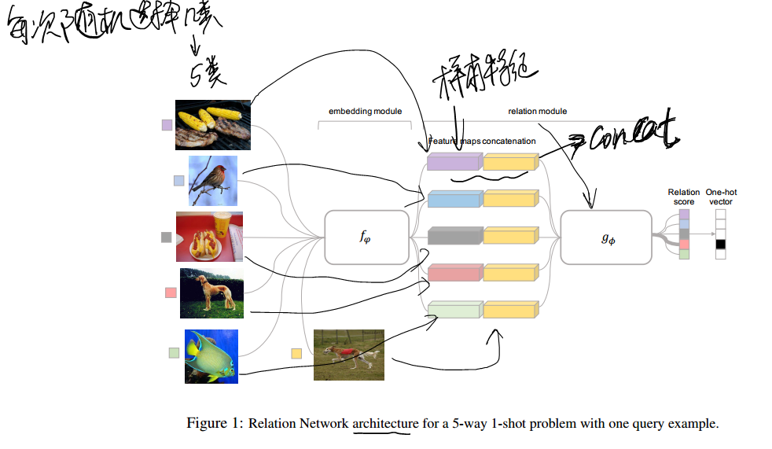
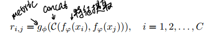
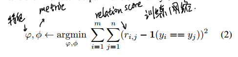

* [paper](paper/2018-Learning%20to%20Compare%20Relation%20Network%20for%20Few-Shot%20Learning.pdf)
* [通过对比实现少样本或零样本学习Learning to Compare: Relation Network for Few-Shot Learning](https://blog.csdn.net/qq_24305433/article/details/79950735)

### 动机

* 我们就发现了，我们人之所以能够识别一个新的东西，在于我们人的视觉系统天生的能够对任意物体提取特征，并进行比较。
* 少样本学习一直和元学习（Meta Learning）关系紧密。元学习的目标就是通过学习大量的任务，从而学习到内在的元知识，从而能够快速的处理新的同类任务，这和少样本学习的目标设定是一样的。
* 我们也希望通过很多任务来学习识别物体这种能力，从而面向新的少样本学习任务，我们能够充分利用我们已经学习到的识别能力（也就是元知识），来快速实现对新物体的识别。

### 方法

###  损失函数

* 学习关系

* 学习目的

